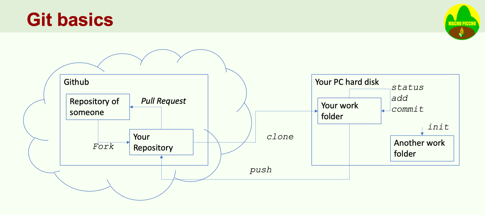

# Github Version Control in VSCode
*(January 2025)*

The Integrated Development Environment (IDE) Visual Studio Code (VSCode) supports version control for code files through integration with Git and GitHub. However, using external Git commands via the console alongside the Git commands available in the VSCode menu can lead to conflicts. The following notes outline the VSCode commands for managing version control effectively.

The current version of VSCode I'm using is:
- Version: 1.96.4 (Universal)
- Commit: 3 cd4ee3b1c348a13bafd8f9ad8060705f6d4b9cba
- Date: 2025-01-16T 00:16:19.038Z
- Electron: 32.1.6
- ElectronBuildId: 10629634
- Chromium: 128.0.6613.186
- Node.js: 20.18.1
- V8: 12.8.374.38-electron.0
- OS: Darwin arm64 24.2.0

Version control is especially useful to synchronize teamwork methods for a hackathon.

*Side note: VS Code is developed on the Electron. Electron is an open-source framework that allows developers to build cross-platform desktop applications using web technologies such as HTML, CSS, and JavaScript. It combines the Chromium rendering engine and the Node.js runtime, enabling developers to create applications that can run on Windows, macOS, and Linux with a single codebase.*

*Electron was originally developed by GitHub and is now maintained by the Electron team at GitHub. It has gained popularity due to its ability to simplify the development process for desktop applications, allowing web developers to leverage their existing skills to create native-like applications. Some well-known applications built with Electron include Visual Studio Code, Slack, and Discord, as well as the AI Coding assistants Cursor and Windsurf.*

# Quick look at git
Since both Visual Studio Code (VSCode) and GitHub utilize Git, we will begin with a brief overview of Git. The illustration below provides a comprehensive overview of the main Git commands.


## Github Fork, start from a repo of someone else (more often)
•	Forking is a concept in GitHub that facilitates collaboration. A GitHub fork creates a copy of another developer's repository under your own account, allowing you to work independently. When you are ready, you can discuss your changes with the original repository owner to prepare a Pull Request (commonly referred to as a "PR"). Once the original owner approves your modifications, a pull from the original repository will be executed to merge your changes into it.

## Git clone, start working from a forked github repository
A clone command creates in your local disk a clone repository of the remote Github repository. We use cloning in hackathons to work on the same project. 

When you run this command, Git performs the following actions:

1. Creates a Local Repository: A new directory is created in the specified local folder, which will contain the cloned repository.
2. Copies the Repository: It downloads all the files, branches, and commit history from the remote repository to your new local directory.
3. Sets Up Remote Tracking: The cloned repository is configured to track the original remote repository, allowing you to easily fetch updates and push changes back to it.
4. Checks Out the Default Branch: By default, Git checks out the main branch (often called main or master), so you can start working with the code immediately.

*Branches allow developers to work on different features, bug fixes, or experiments in isolation from the main codebase, typically referred to as the "main" or "master" branch.*

Command example:
``` zsh
git clone https://github.com/user/repo.git
```
